# 🚀 E-Commerce DevOps Pipeline

Chaîne **DevOps complète** — de la gestion du code source à la supervision en production — construite autour d'une application **e-commerce Java EE**. Le projet couvre **l'intégration continue**, l'**analyse de qualité**, la **conteneurisation**, l'**orchestration Kubernetes** et le **monitoring**.

---

## 🏗️ Architecture — la chaîne DevOps

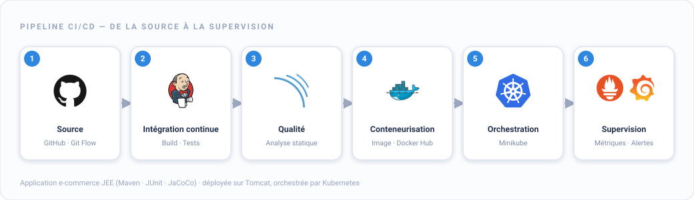

Le code poussé sur **GitHub** déclenche un pipeline **Jenkins** qui build l'application (**Maven**), exécute les **tests** (JUnit + couverture JaCoCo), analyse la qualité via **SonarQube**, construit et publie une **image Docker**, puis déploie sur **Kubernetes** (Minikube). L'ensemble est supervisé par **Prometheus** et **Grafana**.

## 🔄 Le pipeline, étape par étape

### 1️⃣ Jenkins — Intégration continue
Pipeline déclaratif (`Jenkinsfile`) en 7 étapes :
`Checkout → Build (Maven) → Tests unitaires → Tests d'intégration → Rapport de couverture (JaCoCo) → Analyse SonarQube → Déploiement Tomcat`

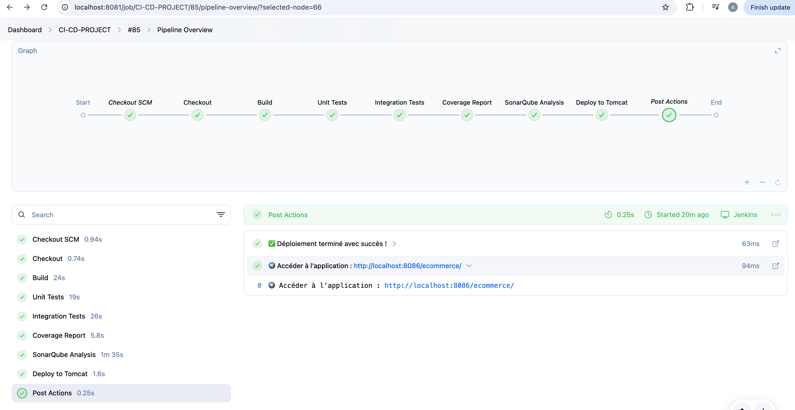

### 2️⃣ SonarQube — Analyse de qualité
Chaque build est analysé par SonarQube : bugs, vulnérabilités, code smells, duplication et couverture. Le **quality gate est au vert (Passed)**.

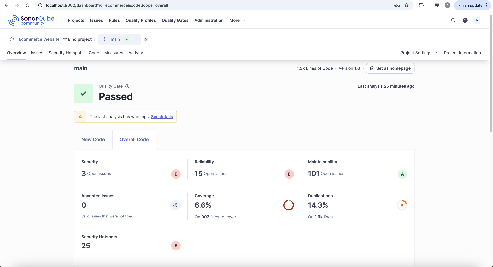

Couverture de code mesurée par **JaCoCo** :

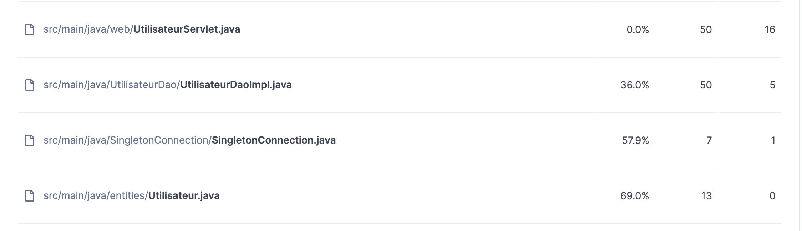

### 3️⃣ Docker — Conteneurisation
L'application est packagée via un **Dockerfile multi-stage** (build Maven → runtime Tomcat, avec `HEALTHCHECK`), puis l'image est publiée sur **Docker Hub**.

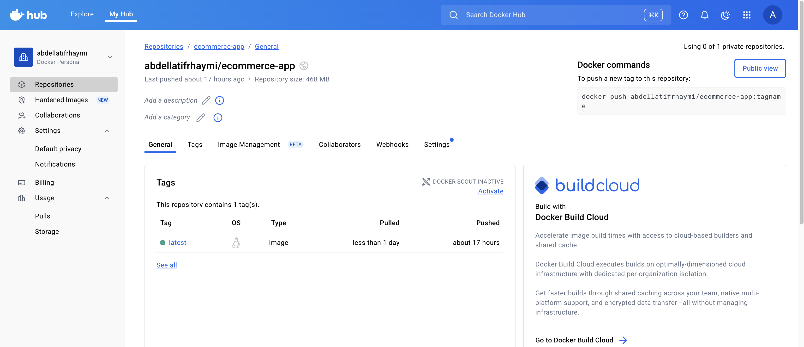

### 4️⃣ Kubernetes — Orchestration
Déploiement sur **Minikube** à l'aide de manifestes complets : `namespace`, `configmap`, `secret`, base **MySQL** (`deployment` + `pvc` + `service`), application (`deployment` + `service`) et `ingress`.

| Manifeste de déploiement | Ressources déployées (`kubectl get all`) |
|:---:|:---:|
| 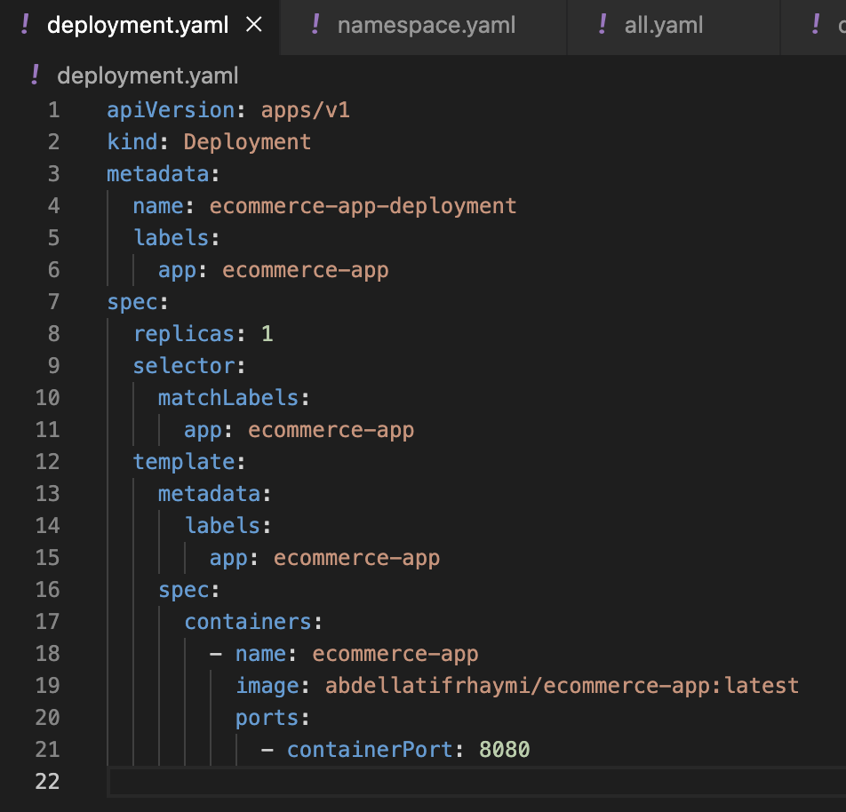 | 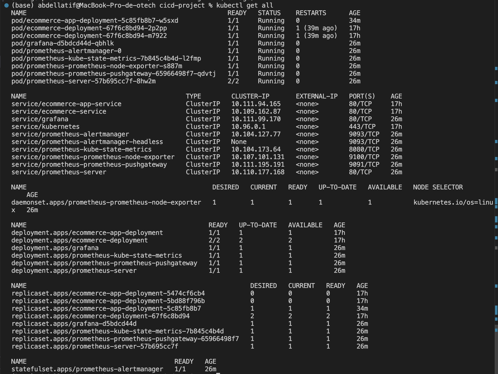 |

### 5️⃣ Prometheus & Grafana — Supervision
Les métriques du cluster et de l'application sont collectées par **Prometheus** (déployé via Helm) et visualisées dans des **tableaux de bord Grafana** (CPU, mémoire, disponibilité, alertes).

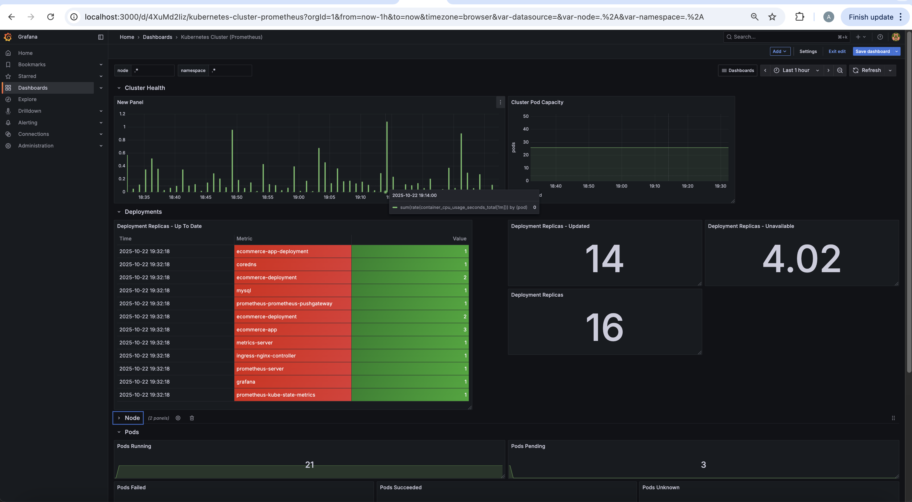

## ⚡ Optimisation du pipeline

Le pipeline a été **optimisé** pour réduire son temps d'exécution :
- **Parallélisation** des étapes de build et de tests (*Build cached · Unit Tests · Unit Tests H2* exécutés en parallèle)
- **Mise en cache** des dépendances Maven (build incrémental)
- **Déploiement incrémental** vers Tomcat

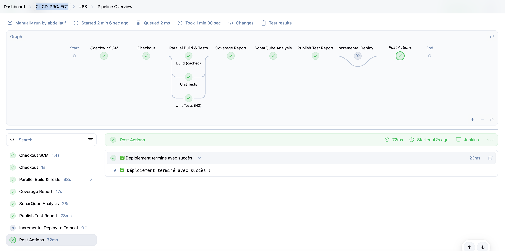

Le graphique ci-dessous compare la durée d'exécution **avant / après** optimisation :

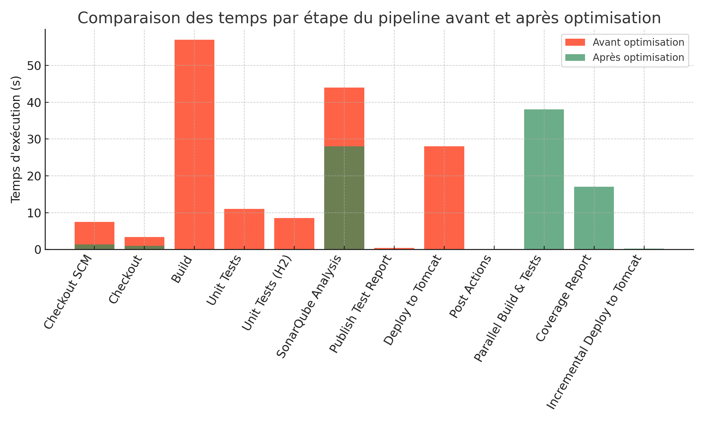

## 🛒 L'application déployée

L'application e-commerce (Java EE) gère les **produits**, **commandes**, **livraisons** et **utilisateurs**. C'est elle qui est buildée, testée, conteneurisée et déployée par la chaîne.

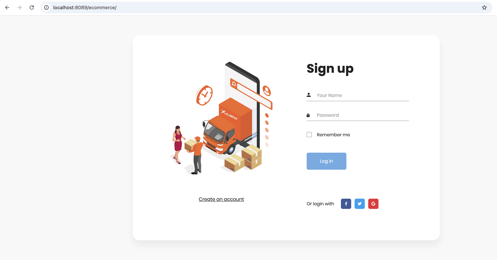

## 🛠️ Stack technique

| Domaine | Technologies |
|---|---|
| **Application** | Java EE (Servlets, JSP, DAO) · Maven · MySQL · Tomcat |
| **CI/CD** | Jenkins (pipeline déclaratif) |
| **Qualité & Tests** | JUnit · JaCoCo · SonarQube |
| **Conteneurisation** | Docker (multi-stage) · Docker Hub · Docker Compose |
| **Orchestration** | Kubernetes · Minikube · Ingress |
| **Supervision** | Prometheus · Grafana (via Helm) |

## 📁 Structure du dépôt

```
├── src/                     # Application Java EE (entités, DAO, servlets, JSP)
├── pom.xml                  # Build Maven
├── Jenkinsfile              # Pipeline CI/CD
├── Dockerfile               # Image applicative (multi-stage Maven → Tomcat)
├── docker-compose.yml       # Stack locale (app · MySQL · Jenkins · SonarQube · phpMyAdmin)
├── jenkins/Dockerfile       # Image Jenkins personnalisée
└── k8s/                     # Manifestes Kubernetes
    ├── namespace · configmap · secret
    ├── mysql-deployment · mysql-pvc · mysql-service
    └── deployment · service · ingress
```

## 🚀 Mise en route

**En local (Docker Compose) :**
```bash
docker-compose up --build
```

**Sur Kubernetes (Minikube) :**
```bash
minikube start
kubectl apply -f k8s/
kubectl get all -n ecommerce-ns
```

> ℹ️ Les identifiants dans `k8s/secret.yaml` et `docker-compose.yml` sont des **valeurs de démonstration** locales. En production, ils seraient gérés via un gestionnaire de secrets (Sealed Secrets, Vault…).

## 👤 Auteur

**Abdellatif RHAYMI** — Ingénieur d'État en Informatique (ENSIAS)
[LinkedIn](https://www.linkedin.com/in/abdellatif-rhaymi/) · [GitHub](https://github.com/abdellatif-rhaymi)
